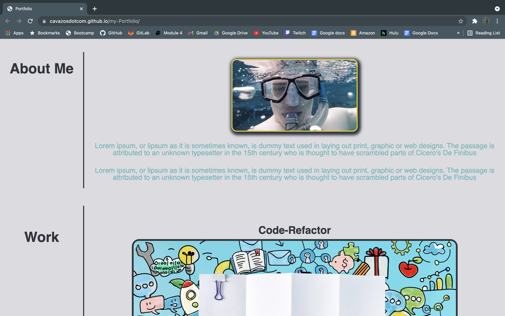
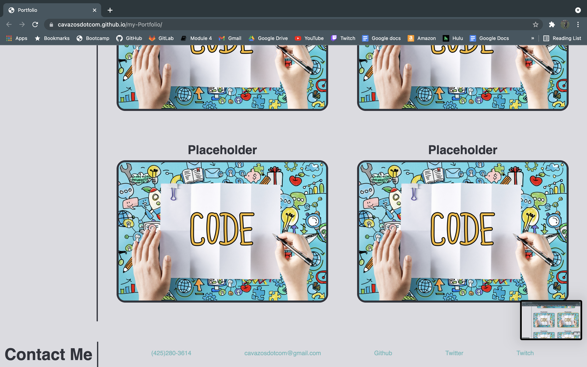

# My-Portfolio
This is my personal portfolio where I get to show off what I can do

# Links
[my-Portfolio Github URL](https://cavazosdotcom.github.io/my-Portfolio/)

[my-Portfolio Github Repo URL](https://github.com/cavazosdotcom/my-Portfolio)

# Picture 

# html
 - working through the html provided many challenges. Learning to restructure my page
 so I can work with flexboxes was the biggest struggle, understanding how they work has been 
 a greatly unforseen challenge. I'm still not at 100% when it comes to usage but I'm sure with practice they'll come

 - Genuinely, going forward using draw.io or google slides will be incredibly important as pseudocode
 for how I will develop my html. Creating the correct number of sections depending on the needs for that project

 - html semantics are also going to be more important, I still need to learn more tags and different uses for each of them

 # css
 - going into my css at the start, I still had little understanding of how to use different box styles and how to set up pages. 
 I spent too much time this week going over all the activities trying to understand the code, I feel like I have improved greatly from where I began but I still have room to grow. Flex boxes are obviously the most difficult obstacle for me, I defenitely understand slightly more how they work and are structured but I just need to practice more doing different things to fully grasp it. It was mostly plug, test, plug, test... in every class or tag to see how they would react and whether it would work. I began with a mobile first approach which was harder than I thought since most of the activities started desktop first, I had a couple examples to learn off of but the css-Snippet was the most beneficial to understanding the whole of the css necessary for this project. Each Section has slightly different semantics for flexboxes cause I came to each with a different approach and I learned more as I progressed, but not wanting to mess up what I got working I kept them how they are instead of trying to make all of them the same. I kept sans-serif as my font because I liked it's style the most on my page.

# On-going development plans
There are still a lot of different things I wanted to do for this project I just didn't have enought to put into doing more, especially with JS right here.

- turn header list into buttons when in mobile so when clicked on any part of the button it will link, instead of just clicking on the text
- mess with more gradients
- replace placeholder images with gradient boxes
- create a header on each card that sits in an absolute position on each card instead of on top, while the cards still hold a relative position on the page
- use more css properties to make header style look better
- find different fonts for mobile and desktop that doesn't mess with padding and margins for the big lines
- phone and email in footer should copy on click
- Make the header links change to white on hover, problem with anchor properties not working
